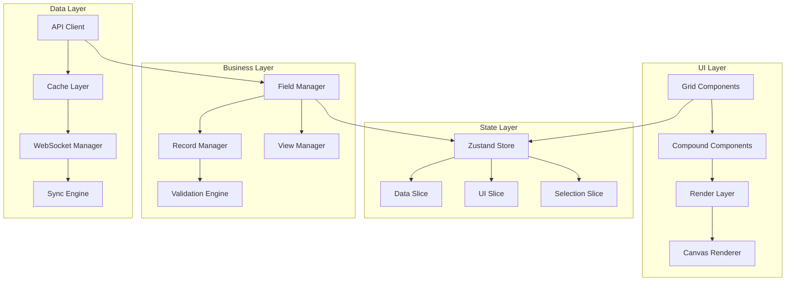

# Grid 架构重构设计文档

## 概述

本设计文档基于需求分析，提出了一个现代化的 Grid 组件架构重构方案。核心目标是解决当前系统中的类型安全问题、状态管理复杂性、性能瓶颈和代码质量问题，构建一个类型安全、高性能、易维护的表格组件库。

## 架构设计

### 整体架构原则

1. **分层架构**：清晰的数据层、业务逻辑层、UI 层分离
2. **类型优先**：Schema-First 设计，完全的类型安全
3. **组合优于继承**：使用 Compound Components 和 Composition 模式
4. **性能优先**：虚拟化、增量更新、智能缓存
5. **可扩展性**：插件化架构，支持自定义扩展

### 核心架构图



## 组件架构

### 1. Compound Components 设计

基于组合模式重新设计组件 API，提供更灵活的使用方式：

```typescript
// 新的组件 API 设计
<Grid>
  <Grid.Header>
    <Grid.ColumnHeader />
    <Grid.RowHeader />
    <Grid.Toolbar>
      <Grid.FilterButton />
      <Grid.SortButton />
      <Grid.GroupButton />
    </Grid.Toolbar>
  </Grid.Header>
  
  <Grid.Body>
    <Grid.VirtualScroller>
      <Grid.Row>
        <Grid.Cell />
      </Grid.Row>
    </Grid.VirtualScroller>
  </Grid.Body>
  
  <Grid.Footer>
    <Grid.Statistics />
    <Grid.Pagination />
  </Grid.Footer>
</Grid>
```

### 2. 组件层次结构

```typescript
interface GridComponents {
  // 容器组件
  Grid: GridComponent & {
    Header: HeaderComponent;
    Body: BodyComponent;
    Footer: FooterComponent;
    
    // 子组件
    ColumnHeader: ColumnHeaderComponent;
    RowHeader: RowHeaderComponent;
    Cell: CellComponent;
    VirtualScroller: VirtualScrollerComponent;
    
    // 功能组件
    Toolbar: ToolbarComponent;
    Statistics: StatisticsComponent;
    Pagination: PaginationComponent;
    
    // 交互组件
    ContextMenu: ContextMenuComponent;
    Editor: EditorComponent;
    Filter: FilterComponent;
  };
}
```

### 3. 渲染层架构

采用分层渲染策略，优化性能：

```typescript
interface RenderLayers {
  // 背景层：网格线、背景色
  BackgroundLayer: CanvasRenderingContext2D;
  
  // 数据层：单元格内容
  DataLayer: CanvasRenderingContext2D;
  
  // 交互层：选择、悬停效果
  InteractionLayer: CanvasRenderingContext2D;
  
  // 覆盖层：编辑器、菜单
  OverlayLayer: HTMLElement;
}
```

## 数据模型

### 1. 类型系统设计

完全重构类型系统，消除所有 `any` 类型：

```typescript
// 核心数据类型
interface StrictFieldType {
  id: string;
  name: string;
  type: FieldTypeEnum;
  config: FieldConfig;
  validation: ValidationRules;
  metadata: FieldMetadata;
}

interface StrictRecordType {
  id: string;
  fields: Record<string, CellValue>;
  metadata: RecordMetadata;
  version: number;
  lastModified: Date;
}

interface StrictViewType {
  id: string;
  name: string;
  type: ViewTypeEnum;
  filter: FilterConfig;
  sort: SortConfig[];
  group: GroupConfig[];
  columnOrder: string[];
  columnWidths: Record<string, number>;
}
```

### 2. 字段类型系统

使用泛型和联合类型确保类型安全：

```typescript
// 字段类型枚举
enum FieldTypeEnum {
  TEXT = 'text',
  NUMBER = 'number',
  DATE = 'date',
  SELECT = 'select',
  MULTI_SELECT = 'multiSelect',
  CHECKBOX = 'checkbox',
  ATTACHMENT = 'attachment',
  FORMULA = 'formula',
  LOOKUP = 'lookup',
  ROLLUP = 'rollup'
}

// 字段配置类型
type FieldConfig<T extends FieldTypeEnum = FieldTypeEnum> = 
  T extends FieldTypeEnum.TEXT ? TextFieldConfig :
  T extends FieldTypeEnum.NUMBER ? NumberFieldConfig :
  T extends FieldTypeEnum.DATE ? DateFieldConfig :
  T extends FieldTypeEnum.SELECT ? SelectFieldConfig :
  // ... 其他类型
  never;

// 单元格值类型
type CellValue<T extends FieldTypeEnum = FieldTypeEnum> = 
  T extends FieldTypeEnum.TEXT ? string :
  T extends FieldTypeEnum.NUMBER ? number :
  T extends FieldTypeEnum.DATE ? Date :
  T extends FieldTypeEnum.CHECKBOX ? boolean :
  // ... 其他类型
  unknown;
```

### 3. 验证系统

内置类型安全的验证引擎：

```typescript
interface ValidationEngine {
  validateField<T extends FieldTypeEnum>(
    value: unknown,
    field: StrictFieldType<T>
  ): ValidationResult<CellValue<T>>;
  
  validateRecord(
    record: Partial<StrictRecordType>,
    fields: StrictFieldType[]
  ): RecordValidationResult;
}

interface ValidationResult<T> {
  isValid: boolean;
  value?: T;
  errors: ValidationError[];
}
```

## 状态管理架构

### 1. Zustand 分片状态设计

替换 Context 嵌套地狱，使用 Zustand 进行状态管理：

```typescript
// 主状态 Store
interface GridStore {
  // 数据状态
  data: DataSlice;
  
  // UI 状态
  ui: UISlice;
  
  // 选择状态
  selection: SelectionSlice;
  
  // 编辑状态
  editing: EditingSlice;
  
  // 视图状态
  view: ViewSlice;
}

// 数据切片
interface DataSlice {
  records: Map<string, StrictRecordType>;
  fields: Map<string, StrictFieldType>;
  views: Map<string, StrictViewType>;
  
  // 操作方法
  updateRecord: (id: string, data: Partial<StrictRecordType>) => void;
  addField: (field: StrictFieldType) => void;
  deleteRecord: (id: string) => void;
  // ...
}

// UI 切片
interface UISlice {
  scrollState: ScrollState;
  mouseState: MouseState;
  dragState: DragState;
  resizeState: ResizeState;
  
  // 操作方法
  setScrollState: (state: ScrollState) => void;
  setMouseState: (state: MouseState) => void;
  // ...
}
```

### 2. 状态同步策略

实现智能的状态同步和缓存：

```typescript
interface StateSyncEngine {
  // 本地状态同步
  syncLocalState: (changes: StateChanges) => void;
  
  // 远程状态同步
  syncRemoteState: (changes: StateChanges) => Promise<void>;
  
  // 冲突解决
  resolveConflicts: (conflicts: StateConflict[]) => StateResolution;
  
  // 离线支持
  queueOfflineChanges: (changes: StateChanges) => void;
  syncOfflineChanges: () => Promise<void>;
}
```

### 3. 性能优化策略

```typescript
interface PerformanceOptimizer {
  // 选择性更新
  selectiveUpdate: (selector: StateSelector) => void;
  
  // 批量更新
  batchUpdates: (updates: StateUpdate[]) => void;
  
  // 内存管理
  garbageCollect: () => void;
  
  // 虚拟化支持
  virtualizeData: (viewport: Viewport) => VirtualizedData;
}
```

## 渲染引擎设计

### 1. 虚拟滚动优化

重新设计虚拟滚动引擎，支持更大数据量：

```typescript
interface VirtualScrollEngine {
  // 视口计算
  calculateViewport: (scrollState: ScrollState) => Viewport;
  
  // 渲染范围
  getRenderRange: (viewport: Viewport) => RenderRange;
  
  // 缓冲区管理
  manageBuffer: (range: RenderRange) => BufferedRange;
  
  // 性能监控
  trackPerformance: () => PerformanceMetrics;
}

interface Viewport {
  startRow: number;
  endRow: number;
  startColumn: number;
  endColumn: number;
  scrollTop: number;
  scrollLeft: number;
}
```

### 2. Canvas 渲染优化

使用 Canvas 提升渲染性能：

```typescript
interface CanvasRenderer {
  // 分层渲染
  renderLayer: (layer: RenderLayer, context: RenderContext) => void;
  
  // 增量更新
  incrementalRender: (changes: RenderChanges) => void;
  
  // 缓存管理
  cacheManagement: CacheManager;
  
  // 设备适配
  deviceAdaptation: DeviceAdapter;
}

interface RenderLayer {
  type: 'background' | 'data' | 'interaction' | 'overlay';
  zIndex: number;
  canvas: HTMLCanvasElement;
  context: CanvasRenderingContext2D;
}
```

### 3. Web Workers 集成

使用 Web Workers 处理复杂计算：

```typescript
interface WorkerManager {
  // 数据处理 Worker
  dataWorker: Worker;
  
  // 计算 Worker
  calculationWorker: Worker;
  
  // 渲染 Worker (OffscreenCanvas)
  renderWorker: Worker;
  
  // 任务调度
  scheduleTask: (task: WorkerTask) => Promise<WorkerResult>;
  
  // 负载均衡
  balanceLoad: () => void;
}
```

## API 层设计

### 1. 统一 API 接口

基于 @luckdb/sdk 构建统一的 API 层：

```typescript
interface UnifiedApiClient {
  // 基础 CRUD
  records: RecordAPI;
  fields: FieldAPI;
  views: ViewAPI;
  bases: BaseAPI;
  tables: TableAPI;
  
  // 实时功能
  realtime: RealtimeAPI;
  
  // 批量操作
  batch: BatchAPI;
  
  // 缓存管理
  cache: CacheAPI;
}

interface RecordAPI {
  list: (params: ListParams) => Promise<PaginatedResponse<StrictRecordType>>;
  get: (id: string) => Promise<StrictRecordType>;
  create: (data: CreateRecordData) => Promise<StrictRecordType>;
  update: (id: string, data: UpdateRecordData) => Promise<StrictRecordType>;
  delete: (id: string) => Promise<void>;
  
  // 批量操作
  bulkCreate: (data: CreateRecordData[]) => Promise<StrictRecordType[]>;
  bulkUpdate: (updates: RecordUpdate[]) => Promise<StrictRecordType[]>;
  bulkDelete: (ids: string[]) => Promise<void>;
}
```

### 2. 缓存策略

实现智能缓存机制：

```typescript
interface CacheStrategy {
  // 多级缓存
  memoryCache: MemoryCache;
  persistentCache: PersistentCache;
  
  // 缓存策略
  strategy: 'lru' | 'lfu' | 'ttl' | 'adaptive';
  
  // 缓存同步
  sync: CacheSyncManager;
  
  // 缓存失效
  invalidation: CacheInvalidationManager;
}
```

### 3. 实时同步

WebSocket 实时同步机制：

```typescript
interface RealtimeSync {
  // 连接管理
  connection: WebSocketManager;
  
  // 事件处理
  eventHandler: RealtimeEventHandler;
  
  // 冲突解决
  conflictResolver: ConflictResolver;
  
  // 协作功能
  collaboration: CollaborationManager;
}
```

## 错误处理

### 1. 错误边界设计

```typescript
interface ErrorBoundarySystem {
  // 组件级错误边界
  ComponentErrorBoundary: React.ComponentType;
  
  // 功能级错误边界
  FeatureErrorBoundary: React.ComponentType;
  
  // 全局错误处理
  GlobalErrorHandler: ErrorHandler;
  
  // 错误恢复
  ErrorRecovery: RecoveryManager;
}
```

### 2. 错误分类和处理

```typescript
enum ErrorType {
  VALIDATION_ERROR = 'validation',
  NETWORK_ERROR = 'network',
  PERMISSION_ERROR = 'permission',
  RENDER_ERROR = 'render',
  STATE_ERROR = 'state'
}

interface ErrorHandler {
  handle: (error: GridError) => ErrorHandlingResult;
  recover: (error: GridError) => Promise<RecoveryResult>;
  report: (error: GridError) => void;
}
```

## 测试策略

### 1. 测试架构

```typescript
interface TestingStrategy {
  // 单元测试
  unitTests: {
    components: ComponentTests;
    hooks: HookTests;
    utils: UtilityTests;
    stores: StoreTests;
  };
  
  // 集成测试
  integrationTests: {
    apiIntegration: APITests;
    stateIntegration: StateTests;
    renderIntegration: RenderTests;
  };
  
  // E2E 测试
  e2eTests: {
    userFlows: UserFlowTests;
    performance: PerformanceTests;
    accessibility: A11yTests;
  };
}
```

### 2. 性能测试

```typescript
interface PerformanceTestSuite {
  // 渲染性能
  renderPerformance: RenderPerfTests;
  
  // 内存使用
  memoryUsage: MemoryTests;
  
  // 响应时间
  responseTime: ResponseTimeTests;
  
  // 大数据量测试
  bigDataTests: BigDataTests;
}
```

## 可访问性设计

### 1. ARIA 支持

```typescript
interface AccessibilitySupport {
  // ARIA 标签
  ariaLabels: ARIALabelManager;
  
  // 键盘导航
  keyboardNavigation: KeyboardNavigationManager;
  
  // 屏幕阅读器
  screenReader: ScreenReaderSupport;
  
  // 高对比度
  highContrast: HighContrastTheme;
}
```

### 2. 国际化支持

```typescript
interface InternationalizationSupport {
  // 多语言
  i18n: I18nManager;
  
  // RTL 支持
  rtl: RTLSupport;
  
  // 本地化
  localization: LocalizationManager;
  
  // 时区处理
  timezone: TimezoneManager;
}
```

## 迁移策略

### 1. 渐进式迁移

```typescript
interface MigrationStrategy {
  // 兼容层
  compatibilityLayer: CompatibilityManager;
  
  // 功能标志
  featureFlags: FeatureFlagManager;
  
  // 数据迁移
  dataMigration: DataMigrationManager;
  
  // 回滚机制
  rollback: RollbackManager;
}
```

### 2. 向后兼容

```typescript
interface BackwardCompatibility {
  // API 兼容
  apiCompatibility: APICompatibilityLayer;
  
  // 组件兼容
  componentCompatibility: ComponentCompatibilityLayer;
  
  // 配置兼容
  configCompatibility: ConfigCompatibilityLayer;
}
```

## 性能指标

### 1. 关键性能指标

- **首次渲染时间**: < 500ms
- **滚动帧率**: 60fps
- **响应时间**: < 100ms
- **内存使用**: < 100MB (10k 记录)
- **包大小**: < 500KB (gzipped)

### 2. 监控和优化

```typescript
interface PerformanceMonitoring {
  // 实时监控
  realTimeMonitoring: MonitoringManager;
  
  // 性能分析
  profiling: ProfilingManager;
  
  // 自动优化
  autoOptimization: OptimizationManager;
  
  // 报告生成
  reporting: ReportingManager;
}
```

这个设计文档提供了一个全面的架构重构方案，解决了当前系统的所有主要问题，同时为未来的扩展和优化奠定了坚实的基础。